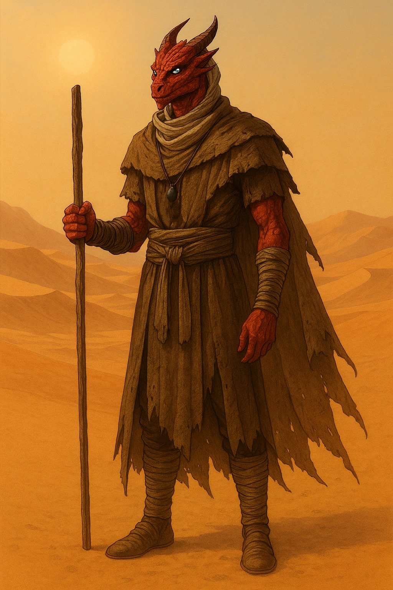

# Christ Han-Desic

## Scheda compattata (giocabile)

## Identita e assetto

- Nome personaggio: Christ Han-Desic
- Giocatore: Saverio
- Classe e livello: Warlock 4
- Patrono: Immondo (Fiend)
- Patto: Patto del Tomo
- Background: Forestiero
- Razza: Draconide-Tiefling
- Allineamento: Neutrale Buono
- Esperienza: 0

## Caratteristiche

Distribuzione consigliata (gia usata nei calcoli):

- Forza 10 (+0)
- Destrezza 14 (+2)
- Costituzione 15 (+2)
- Intelligenza 13 (+1)
- Saggezza 10 (+0)
- Carisma 18 (+4)

Priorita: Carisma > Costituzione > Destrezza.

## Numeri base

- CA: 13 (cuoio 11 + Des 2)
- Iniziativa: +2
- Velocita: 9 m
- Bonus competenza: +2
- PF: 16 attuali segnati / 31 consigliati con ricalcolo retroattivo (se approvato dal DM)
- Dadi vita: 4d8
- Percezione passiva: 10
- Ispirazione: non segnata

## Tiri salvezza

- For +0
- Des +2
- Cos +2
- Int +1
- Sag +2 (competente)
- Car +6 (competente)

## Abilita

Competenze segnate: Atletica, Indagare, Intimidire, Sopravvivenza.

- Acrobazia +2
- Addestrare Animali +0
- Arcano +1
- Atletica +2 (competente)
- Furtivita +2
- Indagare +3 (competente)
- Inganno +4
- Intimidire +6 (competente)
- Intrattenere +4
- Intuizione +0
- Medicina +0
- Natura +1
- Percezione +0
- Persuasione +4
- Rapidita di Mano +2
- Religione +1
- Sopravvivenza +2 (competente)
- Storia +1

### Competenze (classe + background)

- Warlock:
  - Armature: armature leggere
  - Armi: armi semplici
  - Strumenti: nessuno
  - Tiri salvezza: Saggezza, Carisma
  - Abilita di classe scelte: Indagare, Intimidire
- Background Forestiero:
  - Abilita: Atletica, Sopravvivenza
  - Strumenti: armonica

---

## Attacchi e incantesimi per livello

Riferimenti incantatore (Warlock 4):

- Caratteristica: Carisma
- CD incantesimi: 14
- Attacco incantesimi: +6
- Slot Patto: 2 slot di 2 livello (riposo breve/lungo)

### Attacchi e opzioni non magiche/razziali

| Opzione                         | Livello | Gittata/Area | Tiro che fai tu         | Tiro avversario | Danno/Effetto                | Note                                                                                                                |
| ------------------------------- | ------- | ------------ | ----------------------- | --------------- | ---------------------------- | ------------------------------------------------------------------------------------------------------------------- |
| Randello pesante                | Base    | Mischia      | 1d20 +2 vs CA           | Nessuno         | 1d8 contundenti              | Attacco in mischia                                                                                                  |
| Pugnale                         | Base    | 6/18 m       | 1d20 +4 vs CA           | Nessuno         | 1d4+2 perforanti             | Mischia o lancio                                                                                                    |
| Arco corto                      | Base    | 24/96 m      | 1d20 +4 vs CA           | Nessuno         | 1d6+2 perforanti             | Munizioni: 15 frecce segnate                                                                                        |
| Arma a soffio (Draconide rosso) | Razza   | Cono 4,5 m   | Nessun tiro per colpire | TS Des CD 12    | 2d6 fuoco, meta con successo | CD = 8 + Cos + competenza; danni: 2d6 (L1-5), 3d6 (L6-10), 4d6 (L11-15), 5d6 (L16+); recupero su riposo breve/lungo |

Nota livello 4: hai preso Incremento dei Punteggi di Caratteristica (+2 Carisma).

### Trucchetti

| Incantesimo           | Livello    | Gittata/Area | Tiro che fai tu | Tiro avversario | Danno/Effetto                                     | Concentrazione   |
| --------------------- | ---------- | ------------ | --------------- | --------------- | ------------------------------------------------- | ---------------- |
| Deflagrazione occulta | Trucchetto | 36 m         | 1d20 +6 vs CA   | Nessuno         | 1d10 forza                                        | No               |
| Mano magica           | Trucchetto | 9 m          | Nessuno         | Nessuno         | Mano spettrale per interazioni                    | No               |
| Illusione minore      | Trucchetto | 9 m          | Nessuno         | Nessuno         | Crea un suono o un'immagine illusoria statica     | No               |
| Infestazione          | Trucchetto | 9 m          | Nessuno         | TS Cos CD 14    | 1d6 necrotici + spostamento casuale su fallimento | No               |
| Guida                 | Trucchetto | Contatto     | Nessuno         | Nessuno         | +1d4 a una prova di caratteristica                | Si, fino a 1 min |
| Controlla fiamme      | Trucchetto | 18 m         | Nessuno         | Nessuno         | Modifica fiamme non magiche                       | No               |

Totale trucchetti conosciuti al livello 4: 6 (3 Warlock + 3 dal Patto del Tomo).

### Incantesimi di 1 livello

Incantesimi Warlock conosciuti di 1 livello:

| Incantesimo     | Livello | Gittata/Area | Tiro che fai tu | Tiro avversario | Danno/Effetto                       | Concentrazione    |
| --------------- | ------- | ------------ | --------------- | --------------- | ----------------------------------- | ----------------- |
| Comando         | 1       | 18 m         | Nessuno         | TS Sag CD 14    | Ordine di 1 parola (controllo)      | No                |
| Ritirata rapida | 1       | Personale    | Nessuno         | Nessuno         | Scatto come bonus action ogni turno | Si, fino a 10 min |

Rituali annotati nel Libro delle Ombre tramite Libro degli Antichi Segreti:

| Comprendi lingue (rituale) | 1 | Personale | Nessuno | Nessuno | Comprendi linguaggi uditi/scritti | No |
| Servo invisibile (rituale) | 1 | 18 m | Nessuno | Nessuno | Servitore invisibile per compiti semplici | No |
| Allarme (rituale) | 1 | 9 m | Nessuno | Nessuno | Protegge un'area e ti avvisa di intrusioni | No |

### Incantesimi di 2 livello

| Incantesimo    | Livello | Gittata/Area | Tiro che fai tu                           | Tiro avversario | Danno/Effetto                                       | Concentrazione    |
| -------------- | ------- | ------------ | ----------------------------------------- | --------------- | --------------------------------------------------- | ----------------- |
| Raggio rovente | 2       | 36 m         | 3 attacchi: per ogni raggio 1d20 +6 vs CA | Nessuno         | Per raggio: 2d6 fuoco                               | No                |
| Invisibilita   | 2       | Contatto     | Nessuno                                   | Nessuno         | Creatura invisibile finche non attacca/lancia spell | Si, fino a 1 ora  |
| Oscurita       | 2       | 18 m         | Nessuno                                   | Nessuno         | Sfera di oscurita magica di 4,5 m di raggio         | Si, fino a 10 min |

Totale incantesimi Warlock conosciuti al livello 4: 5.

I rituali nel Libro delle Ombre non contano nel totale degli incantesimi conosciuti da Warlock.

Promemoria Warlock 4:

- Gli slot del Patto restano 2 e restano di 2 livello fino al livello 5.
- Non ottieni una nuova Invocazione Mistica al livello 4.
- Non ottieni nuovi rituali automaticamente: Allarme e gli altri rituali vanno copiati nel Libro delle Ombre quando li trovi o se il DM te li concede.

### Come tirare i dadi al tavolo (promemoria veloce)

- Attacco vs CA: tira 1d20 + bonus attacco. Se colpisci, tira i dadi danno.
- Incantesimo con TS: bersaglio tira il TS indicato contro CD 14.
- Raggio rovente: fai 3 tiri separati per colpire, poi danno solo sui raggi che colpiscono.
- Arma a soffio: nessun tiro per colpire; ogni bersaglio nel cono tira Des CD 12.

---

## Privilegi e invocazioni

- Benedizione dell oscuro (Fiend): quando porti una creatura ostile a 0 PF, guadagni PF temporanei = mod Car + livello warlock (ora 8).
- Patto del Tomo: 3 trucchetti extra da qualunque lista.
- Aspetto della Luna: non devi dormire e non puoi essere forzato magicamente a dormire.
- Libro degli Antichi Segreti: puoi aggiungere rituali al Libro delle Ombre e lanciare come rituale quelli copiati nel libro, anche se non sono incantesimi conosciuti da Warlock.

### Checklist livello 4 completata

- Incremento dei punteggi di caratteristica: +2 Carisma.
- Carisma 18: aggiornati CD, attacco incantesimi, abilita sociali, TS Carisma e Benedizione dell oscuro.
- Nuovo trucchetto Warlock scelto: Illusione minore.
- Nuovo incantesimo Warlock conosciuto scelto: Oscurita.
- Nuovo rituale annotato per il Libro degli Antichi Segreti: Allarme.
- PF consigliati portati a 31 e dadi vita a 4d8.
- Nessuna nuova invocazione al livello 4.
- Slot Patto invariati: 2 slot di 2 livello.

## Equipaggiamento e inventario

- Catene costringenti della divinità
- Randello pesante (1d8 contundenti, due mani)
- Arco corto + 15 frecce
- Armatura di cuoio
- Due pugnali
- Focus arcano: una collana (un filo con una pietra scura appesa come ciondolo; il portatore e chi è entro 3 m dall'oggetto, se draconide o immondo, viene percepito come umano da chi non ha mai visto l'entità del tipo corretto)
- Dotazione da avventuriero

Nota focus arcano: per regola di tavolo può ricaricare fino a 2 slot incantesimo per long rest.

Monete:

- 738 mo
- 5 ma
- 5 mr

Lingue e appunti razziali segnati:

- Comune
- Draconico
- Draconide: +2 Forza, +1 Carisma
- Tiefling: +1 Intelligenza
- Scurovisione (Tiefling): 18 m
- Resistenza/Immunita al fuoco (Tiefling): immunita al fuoco (homebrew approvata al tavolo)

Privilegio background:

- Viandante (Forestiero): memoria geografica, orientamento eccellente, capacita di trovare cibo e acqua fresca (in territori non aridi/inospitali).

---

## Personalita e storia

Tratti ruolo:

- Tratti caratteriali: buono e generoso ma testardo
- Ideali: capire le proprie origini e cosa e successo
- Legami: collana e persone del villaggio
- Difetti: mammone, ha bisogno di una figura guida

Aspetto e dati fisici:

- Eta: 20
- Altezza: 190
- Peso: 100
- Occhi: blue
- Carnagione: non chiaramente compilata
- Capelli: neri
- Aspetto percepito: normalmente visto come umano grazie al talismano

Storia consolidata:

Trovato da bambino tra macerie dopo un attacco di demoni fuggiti alle difese della faglia, Christ viene cresciuto da un gruppo di maghi che gli insegnano le arti magiche e lo impiegano nelle difese stesse. Un giorno pero si ritrova solo: maghi e villaggio sono spariti. Sentendosi inesperto e alla ricerca di una guida, passa dal villaggio, raccoglie equipaggiamento e parte in viaggio per scoprire cosa sia accaduto ai suoi concittadini.

Dopo S1, Christ si rende conto di aver contribuito a un massacro costruito su menzogne: i maghi che lo avevano cresciuto probabilmente temevano cio che era davvero e gli avevano nascosto la sua identita. Dopo aver assistito alla strage e al controllo mentale compiuto da quella che poteva essere descritta solo come una divinita dell'acqua e della vita, smette di credere a qualsiasi bussola morale imposta dal mondo e decide di vivere solo secondo il proprio senso di giusto.

Dal risveglio porta dentro una rabbia costante verso quell'entita e verso l'ordine generale delle cose. Ogni volta che prova disgusto o insofferenza per lo stato del mondo, la rabbia ritorna insieme a voci pulsanti provenienti dal ciondolo, che cercano di spingerlo verso la distruzione. A queste si accompagnano emicranie violente, tremori e panico. Odia sia quelle voci sia le divinita cosiddette buone dell'acqua che lasciano dietro di loro villaggi sterminati e terre inaridite.

Dopo il massacro finisce per vagabondare anche per autopunirsi. Per tenere a bada le emicranie comincia a bere: in realta il suo corpo non subisce davvero gli effetti dell'alcol, che sembra quasi bruciare nello stomaco di un drago, ma l'effetto placebo basta a calmarlo e a fermare i tremori.

Ha tirato avanti scommettendo denaro nelle risse e nei combattimenti clandestini a cui partecipa, sopravvivendo solo con la propria forza e sviluppando un forte carisma e veri istinti di sopravvivenza da strada. La saggezza che credeva di aver ereditato dai maghi si e rivelata soltanto un'illusione, come gran parte della sua vita.

Ora si nasconde nei vicoli di Vomase, dove avrebbe dovuto perdere un incontro truccato. Invece, accecato dalla rabbia, ha sconfitto il suo avversario e si e attirato addosso l'attenzione di creditori e organizzatori poco raccomandabili.

Campi non compilati in scheda:

- Alleati e organizzazioni
- Tesoro

---

## Note di correzione applicate

- Setup attuale: For 10, Des 14, Cos 15, Int 13, Sag 10, Car 18.
- TS attuali: For +0, Des +2, Cos +2, Int +1, Sag +2, Car +6.
- Abilita ricalcolate sulla distribuzione attuale.
- Arma a soffio portata a CD 12 (8 + Cos + competenza, secondo tua nota).
- Immunita al fuoco impostata come homebrew di campagna (sostituisce la normale resistenza tiefling).
- Carisma allineato a mod +4.
- Dati da incantatore allineati a CD 14 e attacco +6.
- Benedizione dell oscuro allineata a 8 PF temporanei.
- Livello 4 applicato con +2 Carisma: Carisma 18, CD 14, attacco incantesimi +6, Carisma TS +6.
- PF consigliati al livello 4: 31, dadi vita 4d8.
- Trucchetto Warlock aggiunto: Illusione minore.
- Incantesimo Warlock aggiunto: Oscurita.
- Rituale annotato per Libro degli Antichi Segreti: Allarme.
- Focus arcano aggiornato con la regola di tavolo: ricarica fino a 2 slot incantesimo per long rest.
