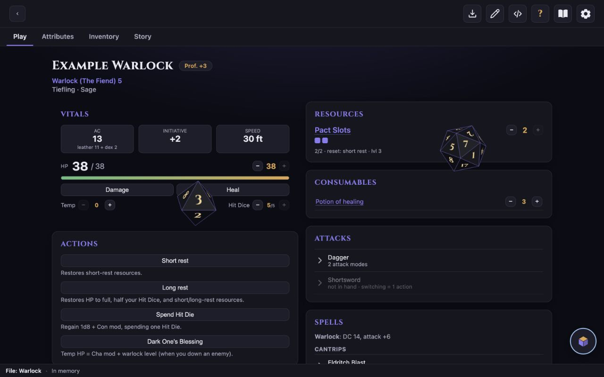
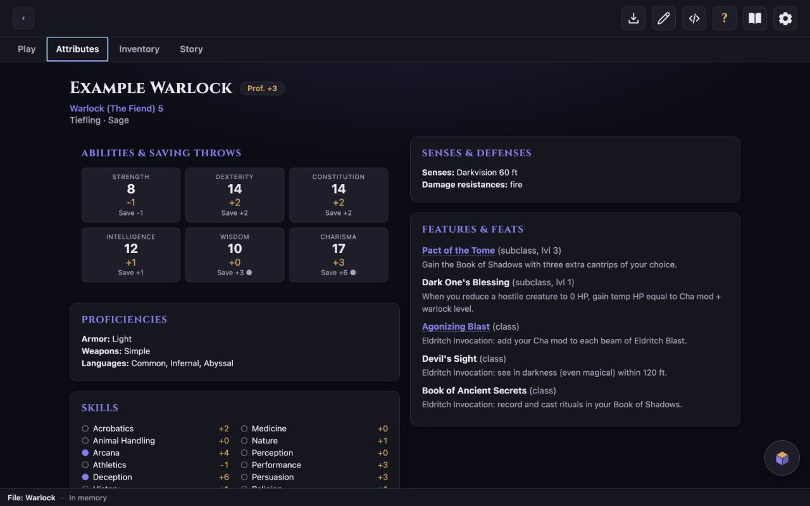

# :JUGALE — "Your character, always yours."

*Pronounced /juˈɡaːle/ — "yoo-GAH-leh".*

A character-sheet platform for tabletop RPGs (D&D 5e in practice) where **the JSON is the character** and the app is a beautiful, stateless lens over it. Build and edit characters with any chatbot (or by hand), then view and *play* them — track HP, resources, spell slots, currencies — with the app kept in sync with a plain, open `character.json`.

| Play at the table | Know every attribute |
| --- | --- |
| [](docs/assets/jugale-play.jpg) | [](docs/assets/jugale-attributes.jpg) |

## Use it

No install, no account, no subscription:

- **Web** — open the live app: **[saverioazzato.github.io/jugale](https://saverioazzato.github.io/jugale/)**. Works in any modern browser; Chromium browsers also save your changes live.
- **Desktop** — download the **macOS**, **Windows**, or **Linux** installer from **[Releases](https://github.com/SaverioAzzato/jugale/releases)**.
- **Android** — download the release-signed APK from the same Releases page and sideload it. JUGALE is not currently built or distributed for iOS.

> **Why your OS may not recognise the publisher:** JUGALE is not distributed through an app store. The macOS build is only ad-hoc signed, without an Apple Developer ID or notarisation; the Windows build is not Authenticode-signed; and Android treats an APK downloaded from GitHub as an app from an external or “unknown” source. The Android APK is release-signed so genuine JUGALE updates can be matched to the same signing key, but that is not the same as Google verifying the developer's identity. Depending on the OS version, settings, reputation and region, you may therefore see messages such as **unidentified/unverified developer**, **unknown publisher**, a SmartScreen warning, or **Install unknown apps**.
>
> These messages concern distribution provenance, publisher identity or reputation; they are not, by themselves, a finding that the app contains malware — nor are they proof that any download is safe. Download only from JUGALE's official GitHub Releases page and check that the repository and release are the ones you expect. On **macOS**, first try to open the app, then use **System Settings → Privacy & Security → Open Anyway** if you trust the download. On **Windows**, inspect the source before using any option SmartScreen offers. On **Android**, allow **Install unknown apps** only for the browser or file manager you used to download the APK, and turn that permission off again afterwards. Linux behaviour varies by package and desktop environment.
>
> JUGALE is a free, open-source personal project. At its current scale, paid signing certificates or developer programmes — plus store-specific release and review overhead — are not justified. The source and automated builds remain public on GitHub; if that trade-off changes, store distribution and fully recognised platform signing can change with it.

Then, on the welcome screen:

1. **Have a character already?** Open its `character.json` (or its folder, to get the portrait too). To apply a JSON returned by a chatbot safely, use **Import character JSON** in the top bar: JUGALE previews it before replacing the open character or creating a new character folder. Recently-opened characters are one click away.
2. **Starting fresh?** Build one with any chatbot using the in-app **Prompts** (the book icon) — they walk you through 5e rules one decision at a time — or turn on **Edit mode** (the pencil) and fill the sheet in by hand. New to the format? See the in-app **Help** (the **?**) or [docs/SCHEMA.md](docs/SCHEMA.md).

> **Status:** the generalized v2 app is live on web, desktop, and Android. The original vanilla-JS prototype is retired and preserved at [`prototype-v1`](https://github.com/SaverioAzzato/jugale/releases/tag/prototype-v1). The [roadmap](docs/ROADMAP.md) records the completed milestones and remaining polish.

## Why

Existing tools lock your character behind their UI and account. Here the source of truth is a human- and GPT-readable `character.json` + an `images/` folder. You can edit it in the app, by hand, or with any external chatbot — no subscription, no lock-in. The same app ships everywhere: **web** (GitHub Pages), **desktop**, and **mobile**, all from one codebase.

## Run from source

For development or building it yourself (end users don't need any of this — just use the [links above](#use-it)):

```bash
npm install
npm run dev        # Vite dev server
npm run preview    # preview the production build locally
npm test           # Vitest unit tests
npm run test:coverage # Vitest with blocking coverage thresholds
npm run test:e2e   # Playwright desktop/mobile Chromium flows
npm run typecheck  # tsc --noEmit
npm run lint       # ESLint
npm run build      # production build + initial-bundle budget
npm run check:docs # schema/command/local-link documentation drift
npm run check      # complete local web gate with coverage
npm run check:ci   # local web gate + Playwright
```

Requires Node 20.19+.

### Desktop (Tauri)

```bash
npm run tauri dev    # native window, hot-reloading the same web build
npm run tauri build   # installable app bundle in src-tauri/target/release/bundle/
```

Requires a Rust toolchain ([rustup](https://rustup.rs)) in addition to Node. The desktop shell wraps the exact same frontend; native file/folder access (`src/storage/tauriProvider.ts`) replaces the browser's File System Access API one-for-one — nothing in `src/render`, `src/schema`, or `src/state` knows which host it's running on.

Android (`npm run tauri android dev` / `build`) shares the same config and requires the Android SDK + NDK + a local `tauri android init` first ([Tauri Android prerequisites](https://v2.tauri.app/start/prerequisites/)); CI builds and attaches a release-signed APK on every tagged release, so this is only needed for local device testing.

## Project structure

```
src/
  schema/        # Zod contract (v2.2), migrations, derivation, validation, JSON Schema
  model/ state/  # game operations and the live Zustand character store
  render/ ui/    # data-driven sheet, editor, dice, settings, prompts, updates
  storage/       # browser, desktop and Android StorageProvider implementations
  i18n/ theme/   # localization and visual themes
src-tauri/       # Tauri 2 desktop/mobile shell + Android filesystem/updater plugins
docs/            # engineering guide plus architecture, schema, automation and product specs
characters/      # sample characters (also test fixtures); your real PGs go in pg/ (gitignored)
index.html       # Vite entry
```

## The `character.json` contract

A character is a folder: `character.json` + `images/`. The JSON is structured enough to validate rules and generate the UI, free enough for any class or homebrew (generic resources, custom sections, links and notes everywhere), and simple enough for an LLM to edit by hand. **[docs/SCHEMA.md](docs/SCHEMA.md)** is both the full contract and the field-by-field user guide for writing or editing one by hand — section by section, with examples and a worked sample at the end.

Rule of thumb: almost everything is **structural** (changes only on level-up/edit); a small
enumerated set is **live** play-state (current/temp HP and remaining Hit Dice, resource `current`,
item quantities/equipped state, currencies and session state). The UI only mutates those live
fields continuously.

Loading is lossless and saving fails closed: validation never replaces the editable JSON with a
default-filled rendering fallback, unknown keys survive round trips, and invalid or future-schema
documents cannot silently overwrite their bound file. The repository verifies this with unit and
adapter contract tests, thresholded coverage, critical Playwright flows and native checks. The
operational rules are in [Engineering](docs/ENGINEERING.md); field semantics remain in
[Schema](docs/SCHEMA.md).

### Where each 5e concept lives

Every game concept has **one home** in the JSON and one place it's edited (in Edit mode — the toolbar pencil — every row below becomes an inline editor). Outputs the rules compute for you (modifiers, proficiency bonus, save DCs, spell attack, total level, passive Perception, attunement count, derived AC) are **never stored** — the app derives them at render time, so you only ever edit the inputs.

| 5e concept | JSON home | Tab → section |
|---|---|---|
| Character name, player, summary, rules in scope | `meta` | header · Story |
| Race, lineage, background, alignment, size, age | `identity` | Attributi → Identity (edit) · Story → Bio |
| Class(es), level, subclass, hit die — multiclass = more entries | `classes[]` | Attributi → Identity |
| Caster ability, known vs. prepared, slot progression | `classes[].spellcasting` | Attributi → Identity |
| Ability scores + saving-throw proficiency | `abilities` | Attributi → Abilities |
| Skill proficiency & expertise | `proficiencies.skills` | Attributi → Skills |
| Armor / weapon / tool proficiencies, **languages** | `proficiencies` | Attributi → Proficiencies |
| Special senses (darkvision, blindsight…) | `senses[]` | Attributi → Senses & defenses |
| Damage resistances / immunities / vulnerabilities, condition immunities | `defenses` | Attributi → Senses & defenses |
| Hit points (max / current / temp), hit dice | `combat.hp` | Gioco → Vitals |
| Armor Class (summed from equipped armor/shield, or override; else 10 + Dex) | `inventory.items[].ac` · `combat.armorClassOverride` | Gioco → Vitals · Inventario |
| Initiative, speed | `combat.initiativeOverride` · `combat.speed` | Gioco → Vitals |
| Weapon attacks (per mode: 1h / 2h / thrown) | `inventory.items[].attacks[]` | Inventario (edit) → Gioco → Attacks |
| Innate attacks (natural weapons, unarmed, breath weapon) | `combat.attacks[]` | Gioco → Attacks |
| Spell slots, pact magic, ki, rage, sorcery points, channel divinity, charges, ammo | `resources[]` (generic) | Gioco → Resources |
| Spells (casting time, ritual, V·S·M components + materials, damage & type, higher-level scaling), grouped into sections | `spellSections[]` | Gioco → Spells |
| Class / subclass / race / background / feat features (invocations, metamagic, maneuvers, fighting styles…) | `features[]` (by `source`) | Attributi → Features |
| Limited-use feature → its resource | `features[].uses` | Attributi → Features |
| Items: quantity, weight, value, equipped, attuned, category | `inventory.items[]` | Inventario |
| Currencies | `inventory.currencies` | Inventario |
| Racial traits, background feature | `origin` | Story → Origin |
| Personality, ideals, bonds, flaws, appearance, backstory | `narrative` | Story |
| Portrait & gallery | the folder's `images/` (never in the JSON) | header · Story |
| Conditions, inspiration, death saves, session notes (live) | `session` | Gioco → Status |
| Rests & one-tap custom effects (formula-driven) | `actions[]` | Gioco → Actions |
| Anything the schema doesn't anticipate (homebrew tables, checklists…) | `customSections[]` | Story → Custom |

When you change the schema, see the checklist in [docs/SCHEMA.md](docs/SCHEMA.md#6-changing-the-schema) for every place that has to move together.

## GPT prompts

The in-app Prompts page (the book icon next to Settings) provides the **base / create / level-up / validate** workflows, a standalone **migrate** workflow and a **custom** instruction for any external chatbot (ChatGPT, Claude, etc.). Beside every prompt, **Download bundle** saves one text file containing the composed prompt and current JSON Schema; when a character is open it also contains the complete `character.json`, and Migrate adds the schema changelog. The bundle works on web, desktop and Android, while Android also offers direct sharing through the system chooser. The full workflow is documented in **[docs/PROMPTS.md](docs/PROMPTS.md)**.

## Content & licensing

By default, characters ship with `meta.ruleset: ["SRD 5.1"]`: the CC-BY-4.0-licensed, 2014 fifth-edition rules. **SRD 5.2.1 is the revised 2024/5.5e rules and is not interchangeable with SRD 5.1.** A character that uses it should say `"SRD 5.2.1"` explicitly; avoid the ambiguous bare label `"SRD"`. Nothing in the schema, prompts, or `.github/agents/` seed material selects a commercial sourcebook by default. A character may contain links to third-party pages chosen by its author; HTTPS is recommended. JUGALE only displays those URLs and opens them in the system browser. It does not fetch, scrape, cache, preview, proxy, index, or reproduce the linked pages, and a link does not imply affiliation, endorsement, or any guarantee about the destination or its availability.

You may manually consult any material you can lawfully access. Automated retrieval or AI access is different: owning a book, subscription, or account does **not** by itself grant permission to scrape or submit its contents to an AI service. Only use automated retrieval where the source's licence and terms explicitly permit it; never bypass a login, paywall, access control, or other technical restriction. Character authors are responsible for their chosen content and links and for complying with applicable licences, terms, and law.

The bundled examples use **SRD 5.1** material. The required attribution, modification notice, independent-project disclaimer, Fan Content Policy analysis, asset terms, and dependency notices are collected in **[Legal & content notices](docs/LEGAL.md)**. JUGALE is an independent project and is not affiliated with, endorsed, sponsored, or approved by Wizards of the Coast. It does not use Wizards logos or artwork and does not claim permission under the Fan Content Policy for the SRD material: that material is used under CC BY 4.0.

## Distribution

Free and open: the **web app is the GitHub Pages site** ([live](https://saverioazzato.github.io/jugale/)); desktop and Android binaries are attached to **GitHub Releases**. Both are built and shipped by GitHub Actions, and both happen on the same trigger: **pushing a version tag** (`v*`) — [`pages.yml`](.github/workflows/pages.yml) redeploys the web app, [`release.yml`](.github/workflows/release.yml) builds Mac/Win/Linux installers plus an Android APK and attaches them to a draft GitHub Release. Desktop updater artifacts are cryptographically signed so the app can authenticate updates; this is separate from the operating-system publisher signing described above. Android checks the same releases in-app and installs a release-signed APK through its native updater. Merging to `main` alone does not ship a release. Before tagging, run [`scripts/set-version.sh`](scripts/set-version.sh) to keep the five version files aligned, regenerate the legal artifacts with `npm run legal:generate`, and follow [Cutting a release](docs/AUTOMATION.md#cutting-a-release). No app stores, no hosting bills.

## Contributing & automation

See **[CONTRIBUTING.md](CONTRIBUTING.md)** for the project's ground rules before sending a PR.

- CI (`.github/workflows/ci.yml`) runs documentation drift checks, zero-warning lint, typecheck,
  thresholded coverage, build/bundle budget and desktop/mobile Chromium E2E on every PR; a PR
  touching `src-tauri/` also gets a fast Rust `cargo check` (`tauri-check.yml`, no bundling).
- You can hand Claude a ticket and get a PR back — via [Claude Code on the web](https://claude.ai/code) (runs on Anthropic's cloud) or a local Claude Code session. See **[docs/AUTOMATION.md](docs/AUTOMATION.md)**.

## Docs

- [Engineering](docs/ENGINEERING.md) · [Architecture](docs/ARCHITECTURE.md) · [Schema](docs/SCHEMA.md) · [UI](docs/UI.md) · [Prompts](docs/PROMPTS.md) · [Legal](docs/LEGAL.md) · [Roadmap](docs/ROADMAP.md) · [Automation](docs/AUTOMATION.md)

## Assets & Credits

The example character images in [`characters/example-warlock/images/`](characters/example-warlock/images/) were generated with **ChatGPT (OpenAI)** and are included for demonstration purposes. They and the documentation/help screenshots are separate from the code and licensed, to the extent the project author owns rights in them, under **[CC BY 4.0](ASSETS-LICENSE.md)**.

## License

The **code** is released under the [MIT License](LICENSE). This covers the application code only — D&D rules content and project images have their own terms above, while dependencies retain their upstream licences. Every build includes the readable [`THIRD_PARTY_NOTICES.txt`](public/THIRD_PARTY_NOTICES.txt) and machine-readable [SPDX SBOM](public/third-party-sbom.spdx.json) generated from the JavaScript and Rust lockfiles.
